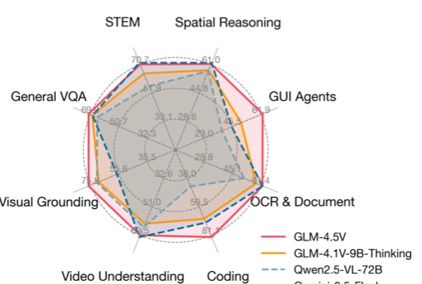

# GLM-4.5V and GLM-4.1V-Thinking: Towards Versatile Multimodal Reasoning with Scalable Reinforcement Learning

GLM-V Team

Zhipu AI & Tsinghua University

(For the complete list of authors, please refer to the Contribution section)

## Abstract

We present GLM-4.1V-Thinking and GLM-4.5V, a family of vision-language models (VLMs) designed to advance general-purpose multimodal understanding and reasoning. In this report, we share our key findings in the development of the reasoning-centric training framework. We first develop a capable vision foundation model with significant potential through large-scale pre-training, which arguably sets the upper bound for the final performance. We then propose Reinforcement Learning with Curriculum Sampling (RLCS) to unlock the full potential of the model, leading to comprehensive capability enhancement across a diverse range of tasks, including STEM problem solving, video understanding, content recognition, coding, grounding, GUI-based agents, and long document interpretation. In a comprehensive evaluation across 42 public benchmarks, GLM-4.5V achieves state-of-the-art performance on nearly all tasks among open-source models of similar size, and demonstrates competitive or even superior results compared to closed-source models such as Gemini-2.5-Flash on challenging tasks including Coding and GUI Agents. Meanwhile, the smaller GLM-4.1V-9B-Thinking remains highly competitive—achieving superior results to the much larger Qwen2.5-VL-72B on 29 benchmarks. We open-source both GLM-4.1V-9B-Thinking and GLM-4.5V. Code, models and more information are released at https://github.com/zai-org/ GLM-V

(A) Comparison with baselines

(B) Reinforcement learning gains

Figure 1: (A) GLM-4.5V achieves efficient scaling based on its compact predecessor, GLM-4.1V-9B-Thinking, and compares favorably with Gemini-2.5-Flash, according to benchmark assessments. Table 2 presents full performance comparison. (B) Reinforcement learning substantially boosts the model's performance, with gains of up to $ + 10.6 \% $ when experimented with GLM-4.5V.
